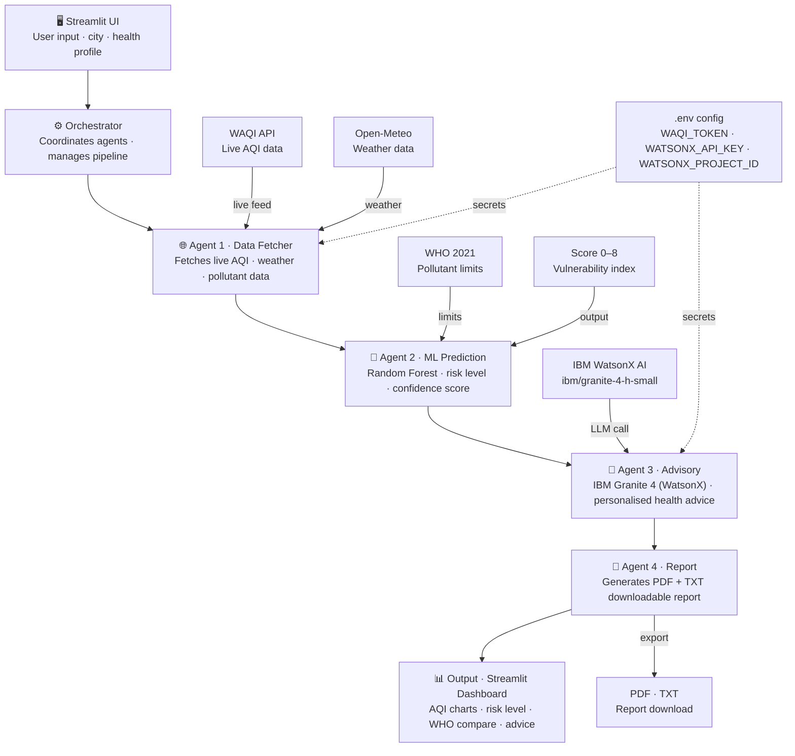

# 🌫️ AirSeva: Agentic Air Quality Health Advisory System

AirSeva is a 4-agent agentic AI system designed to provide real-time air quality health advisories tailored for Indian communities. By integrating real-time environmental data with machine learning risk prediction and IBM Granite 4-powered LLM advisories via WatsonX, AirSeva helps individuals manage their exposure to air pollution based on their personalized health profile.

Developed as part of the **1M1B AI for Sustainability** internship in collaboration with **IBM SkillsBuild + AICTE** at **Dayananda Sagar University, Bangalore**.

---

## 📖 Project Overview

AirSeva operates as an orchestrated multi-agent system that bridges environmental data science with actionable public health insights. It auto-detects or accepts a user's location (from 26 supported Indian cities), queries live pollution and historical weather data, predicts health risk levels using a trained Random Forest model, generates context-aware medical recommendations using IBM Granite 4 (WatsonX), and compiles standard PDF and text health reports.

---

## ✨ Features

- **4-Agent Pipeline**: Highly modularized agent workflow orchestrated in sequence to fetch data, predict risk, generate advisories, and compile reports.
- **📍 GPS Snapping & Fallback**: Snaps user's GPS coordinates to the nearest supported city or allows selection via search/dropdown.
- **👤 Personal Health Profile**: Dynamic inputs for age, asthma, smoking status, and outdoor work conditions.
- **🧮 Personalized Vulnerability Score (0–8)**: A weighted index highlighting the user's specific susceptibility to air pollution.
- **🤖 Machine Learning Risk Prediction**: Random Forest model predicting health risk level (Low / Moderate / High) with classification confidence.
- **📊 WHO 2021 Guidelines Comparison**: Interactive bar charts comparing live chemical readings against strict WHO 2021 limit standards.
- **📥 Downloadable Reports**: Exports clean summaries as TXT files or formatted PDFs complete with health recommendations.

---

## 🏗️ Architecture



---

## 🛠️ Tech Stack

- **Core & Logic**: Python 3.10+
- **Frontend / Web App**: Streamlit
- **ML Framework**: scikit-learn 1.8.0 (Random Forest Classifier)
- **Generative AI API**: ibm-watsonx-ai (using `ibm/granite-4-h-small` via WatsonX Frankfurt)
- **Data APIs**: WAQI API (World Air Quality Index), Open-Meteo Air Quality API
- **Data Processing**: pandas, numpy
- **Visualization**: Plotly, Folium, streamlit-folium
- **PDF Generation**: fpdf2

---

## 📁 Project Folder Structure

```
SRP_PROJECT/
├── agents/                      # Modulized 4-agent logic
│   ├── agent_1_data_fetcher.py  # Fetches live/historical API data and engineers lag features
│   ├── agent_2_ml_prediction.py # Runs Random Forest model prediction
│   ├── agent_3_advisory.py      # Queries IBM Granite 4 (WatsonX) for personalized advice
│   └── agent_4_report.py        # Compiles structured JSON/text reports and checks WHO limits
├── data/                        # Datasets (CPCB India Kaggle data)
│   ├── city_day.csv
│   └── city_day_cleaned.csv
├── models/                      # ML models
│   └── health_risk_rf_model.pkl # Trained Random Forest model file
├── notebooks/                   # Jupyter notebooks for model development & EDA
├── app.py                       # Main Streamlit dashboard application
├── orchestrator.py              # CLI & module execution manager orchestrating all 4 agents
├── requirements.txt             # Project library dependencies
└── .env                         # Local environment configuration file (ignored in Git)
```

---

## 🚀 Setup & Execution Instructions

Follow these steps to set up and run the project locally on your machine:

### 1. Create a Virtual Environment
```bash
python -m venv .venv
```
Activate the environment:
- **Windows (PowerShell)**: `.venv\Scripts\Activate.ps1`
- **Mac/Linux**: `source .venv/bin/activate`

### 2. Install Project Dependencies
```bash
pip install -r requirements.txt
```

### 3. Configure Local Environment Variables
Create a file named `.env` in the project root directory:
```env
WAQI_TOKEN=your_waqi_api_token_here
WATSONX_API_KEY=your_ibm_watsonx_api_key_here
WATSONX_PROJECT_ID=your_ibm_watsonx_project_id_here
```
* Note: You can obtain a free WAQI token at [aqicn.org/data-platform/token/](https://aqicn.org/data-platform/token/).

### 4. Run the Streamlit Dashboard
```bash
streamlit run app.py
```
The application will launch and be accessible in your web browser at `http://localhost:8501`.

---

## 🤖 The 4-Agent Architecture

AirSeva partitions its logic across 4 distinct autonomous agents:

```
[User Input] ──> [Agent 1: Data Fetcher] ──> [Agent 2: ML Predictor] ──> [Agent 3: Advisor] ──> [Agent 4: Reporter] ──> [Final PDF/TXT]
```

1. **Agent 1: Data Fetcher (`agent_1_data_fetcher.py`)**
   Resolves the requested location into one of the 26 canonical Indian cities. Fetches live pollutant indices ($PM_{2.5}, PM_{10}, NO_2, SO_2, CO, O_3$) from the WAQI API, queries 7-day hourly historical readings from Open-Meteo, and computes rolling average/lag features.
2. **Agent 2: Machine Learning Predictor (`agent_2_ml_prediction.py`)**
   Prepares the 22 engineered features, loads the pre-trained Random Forest model, and predicts the class health risk level (Low, Moderate, High) along with class assignment confidence.
3. **Agent 3: Health Advisor (`agent_3_advisory.py`)**
   Takes the live pollutant concentrations, ML risk level, and user vulnerability details and prompts `ibm/granite-4-h-small` via IBM WatsonX AI using structured system instructions to formulate highly tailored, empathetic, and actionable medical/lifestyle advice.
4. **Agent 4: Report Compiler (`agent_4_report.py`)**
   Validates outputs, checks concentration levels against strict WHO 2021 air quality limits, compiles a structured JSON output, and formats raw text summaries alongside PDF export utilities.

---

## Responsible AI Considerations

AirSeva is designed with responsible AI principles 
embedded across its 4-agent pipeline, in line with 
Section 7 guidelines.

### Fairness
- Health advisories are benchmarked against WHO 2021 
  Air Quality Guidelines, ensuring the same global 
  health standard is applied regardless of city tier.
- Coverage spans 26 Indian cities across metro, 
  Tier-2, and Tier-3 categories, avoiding metro-centric 
  bias common in existing AQI tools that focus only on 
  Delhi/Mumbai/Bengaluru.
- The ML prediction model is trained on pooled 
  multi-city data, so advisory logic is not skewed 
  toward any single region's pollution profile.

### Transparency
- The system exposes its reasoning at every stage: 
  the Random Forest model's AQI prediction is shown 
  alongside the raw input pollutant data (PM2.5, PM10, 
  NO2, etc.) used to generate it.
- The IBM Granite Advisory Agent's recommendations are 
  presented as generated guidance, not as black-box 
  output — users can see which AQI category and city 
  data informed the advisory.
- Agent roles (data fetch, prediction, advisory, 
  report) are clearly separated and documented, so 
  users understand which component produced which 
  output.

### Ethics
- AirSeva provides general health advisory guidance 
  based on air quality conditions. It is NOT a 
  substitute for professional medical diagnosis or 
  treatment.
- A visible disclaimer is shown in the app: 
  "This advisory is for informational purposes only 
  and does not constitute medical advice. Please 
  consult a healthcare professional for medical 
  concerns, especially for vulnerable groups."
- Recommendations are framed as precautionary 
  (e.g., "consider reducing outdoor activity") rather 
  than prescriptive medical instructions.

### Privacy
- AirSeva does not collect, store, or process any 
  personal user data (name, location, health records, 
  device identifiers).
- All air quality data used is public, city-level 
  AQI data sourced from open APIs/datasets — no 
  individual tracking or profiling occurs.
- No user session data is retained beyond the active 
  Streamlit session.

---

## Target Users

AirSeva is designed to serve a broad range of stakeholders 
involved in air quality awareness and public health response:

- **General Public**: Citizens seeking real-time, location-based 
  air quality information and simple health guidance for daily 
  outdoor activity planning.
- **Vulnerable Groups**: Children, elderly individuals, pregnant 
  women, and patients with respiratory conditions (e.g., asthma, 
  COPD) who require more cautious, tailored advisories during 
  poor air quality periods.
- **ASHA Workers & Community Health Volunteers**: Frontline 
  health workers who can use AirSeva's advisories to guide 
  awareness campaigns and counsel vulnerable households in 
  their communities.
- **Urban Local Bodies & Policy Makers**: Municipal and city 
  administration teams who can reference city-level AQI trends 
  and health impact data to inform public advisories and 
  policy decisions.

---

## Problem Statement

How might we use AI to provide accessible, real-time, and 
location-specific air quality health advisories so that 
communities across India — especially vulnerable groups — 
can take timely precautions and become more resilient to 
air pollution?

## Impact Statement

AirSeva empowers individuals and communities to make informed, 
health-conscious decisions based on real-time air quality data 
across 26 Indian cities. By translating raw pollutant data into 
clear, actionable advisories, it bridges the gap between 
complex environmental monitoring and everyday public health 
behavior.

**Who benefits:**
- **Citizens** gain immediate, easy-to-understand guidance on 
  outdoor activity safety.
- **Vulnerable groups** (children, elderly, asthma/COPD patients) 
  receive tailored precautionary advice during high-pollution periods.
- **ASHA workers and health volunteers** get a reliable reference 
  tool to support community health awareness efforts.
- **Urban local bodies** can use aggregated trends to inform 
  localized public health advisories.

**What changes:**
- Reduces the gap between AQI data availability and public 
  understanding/action.
- Encourages proactive health behavior (e.g., mask usage, 
  reduced outdoor exposure) during poor air quality days.
- Supports India's broader sustainability goals by increasing 
  public awareness of air quality as a health and environmental 
  issue (aligned with SDG 3 - Good Health & Well-being, and 
  SDG 11 - Sustainable Cities & Communities).

---

## 🏙️ Supported Indian Cities (26)

AirSeva tracks and snaps location queries to these 26 major cities:

| | | | |
|---|---|---|---|
| Ahmedabad | Chandigarh | Hyderabad | Patna |
| Aizawl | Chennai | Jaipur | Shillong |
| Amaravati | Coimbatore | Jorapokhar | Talcher |
| Amritsar | Delhi | Kochi | Thiruvananthapuram |
| Bengaluru | Ernakulam | Kolkata | Visakhapatnam |
| Bhopal | Gurugram | Lucknow | |
| Brajrajnagar | Guwahati | Mumbai | |

---

## 📊 WHO 2021 Air Quality Limits

The system compares real-time chemical concentration readings against these strict guidelines:

| Pollutant | WHO 2021 Limit Value | Averaging Time |
|---|---|---|
| **PM2.5** | $15.0 \ \mu g/m^3$ | 24-hour |
| **PM10** | $45.0 \ \mu g/m^3$ | 24-hour |
| **NO2** | $10.0 \ \mu g/m^3$ | Annual |
| **SO2** | $40.0 \ \mu g/m^3$ | 24-hour |
| **CO** | $4.0 \ mg/m^3$ | 8-hour |
| **O3** (Ozone) | $60.0 \ \mu g/m^3$ | 8-hour |

---

## 🧮 Vulnerability Score Guide (0–8)

User vulnerability is evaluated out of a maximum score of 8 based on weighted physiological and lifestyle indicators:

* **Age Profile** (Max 2 pts):
  - Age $< 12$ or $> 60$ years: **+2 points** (sensitive populations)
  - Age $12 - 60$ years: **0 points**
* **Asthma Diagnosis** (Max 3 pts):
  - Diagnosed with Asthma: **+3 points**
* **Smoking Habit** (Max 2 pts):
  - Smoker: **+2 points**
* **Occupational Exposure** (Max 1 pt):
  - Outdoor Worker: **+1 point**

### Vulnerability Level Categories:
- **Score 0 – 1**: **🟢 Low Vulnerability**
- **Score 2 – 4**: **🟡 Moderate Vulnerability**
- **Score 5 – 8**: **🔴 High Vulnerability**

---

## Internship & Credentials

This project was built during the MCA internship program:

- **Program**: 1M1B (1 Million for 1 Billion) AI for Sustainability
- **Partners**: IBM SkillsBuild + AICTE
- **Developer**: Shreenivas S B
- **Institution**: Dayananda Sagar University, Bangalore
